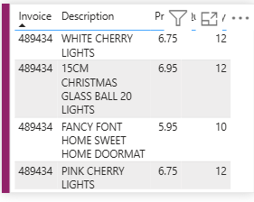

# Online-Retail-Dashboard
# 🛍️ Online Retail Dashboard (Power BI)

This repository contains a Power BI dashboard created for analyzing **online retail sales** data. The dashboard provides key insights into customer behavior, sales performance, and regional trends to support better business decision-making.

---

## 📊 Dashboard Features

- 📅 Time-based Sales Analysis  
- 🧑‍🤝‍🧑 Top Customers by Revenue  
- 🌍 Sales by Country and Region  
- 📦 Product Category Performance  
- 🔄 Returns and Order Cancellations  
- 🧠 KPI Cards (Revenue, Orders, Profit)

---

## 📁 File Contents

- `Online_Retail_Dash.pbix` – Main Power BI file containing all data models, visuals, and transformations.

---

## 🚀 How to Use

1. Clone or download the repository.
2. Open the `.pbix` file in **Microsoft Power BI Desktop**.
3. Refresh the data source if needed.
4. Explore the dashboard pages and interact with filters and slicers.

---

## 📌 Project Purpose

This project was built to demonstrate:
- Power BI dashboarding skills
- Data cleaning and transformation using Power Query
- Visual storytelling and KPI-driven analysis
- Real-time business insights from transactional data

---

## 📦 Tools & Technologies

- Microsoft Power BI Desktop  
- Power Query for ETL  
- DAX for calculated columns and measures  
- CSV or Excel-based data source (assumed)

---

## 📸 Dashboard Screenshots

### 1️⃣ Visuals Page  
This page provides an overview of the key metrics, including Sales by Country and by Month, product descriptions, and overall sales performance.

---

### 2️⃣ Tooltip Page  
This tooltip appears when hovering over data points to show detailed invoice-level information in a compact format.

---

### 3️⃣ Drill-Through Pane  
The drill-through feature allows users to deep-dive into a specific customer or product's transaction details, with KPIs like Avg Quantity, Total Spend, and Total Orders.

---

## 🙋‍♀️ Author

**Vaishnavi Karnik**  
[LinkedIn]() | [GitHub](https://github.com/vaishnavikarnik)

---

## 📝 License

This project is licensed under the MIT License. Feel free to use or modify with attribution.
